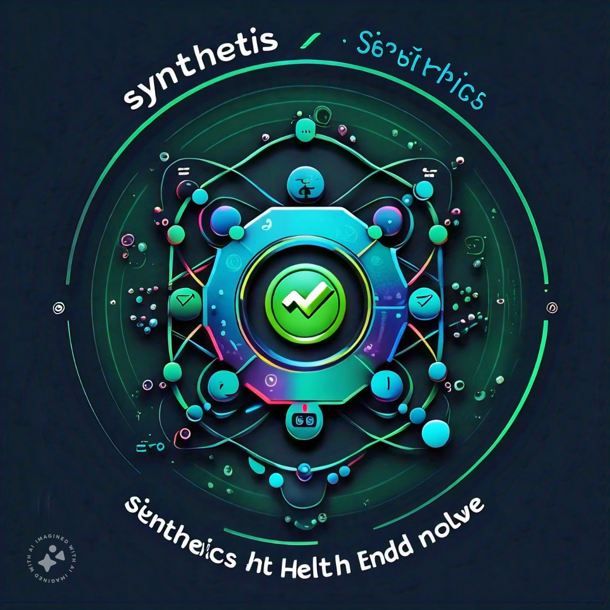

<p align="center">
  
</p>
<p align="center">
    <h1 align="center">SYNTHETICS</h1>
</p>
<p align="center">
    <em><code>Edge Node to make HealthChecks</code></em>
</p>
<p align="center">
  
  
  
  
</p>
<p align="center">
    <em>Built with the tools and technologies:</em>
</p>
<p align="center">
  
  
  
  
  
  
  
  <br>
  
  
  
  
  
  
</p>

<br>

##### 🔗 Table of Contents

- [📍 Overview](#-overview)
  - [Use case](#use-case)
- [👾 Features](#-features)
- [Integration with Sentinel](#integration-with-sentinel)
  - [Additional Considerations](#additional-considerations)
- [📦 Installation](#-installation)
  - [Run Synthetics Docker image](#run-synthetics-docker-image)
    - [🤖 Run Synthetics via Docker CLI](#-run-synthetics-via-docker-cli)
    - [🧪 Stop The Synthetics Container](#-stop-the-synthetics-container)
  - [Run Synthetics via Docker Compose](#run-synthetics-via-docker-compose)
    - [Before you begin](#before-you-begin)
    - [Run the latest stable version of Synthetics](#run-the-latest-stable-version-of-synthetics)
    - [Stop the Synthetics container](#stop-the-synthetics-container)
- [📌 Project Roadmap](#-project-roadmap)
- [🤝 Contributing](#-contributing)
- [🎗 License](#-license)
- [🙌 Acknowledgments](#-acknowledgments)

---

## 📍 Overview

This Express.js server acts as a health check endpoint for a master node, referred to as the "sentinel." It receives requests from the sentinel, performs a health check based on specified criteria, and returns a response indicating the success or failure of the check, along with the time taken to complete the operation.

### Use case
1. **Monitoring Node Health:**
Regularly assess the health and responsiveness of the sentinel node.
2. **Triggering Alerts:** Initiate alerts or actions based on health check results, such as restarting services or notifying administrators.
3. **Ensuring System Availability:** Help maintain system uptime and stability by proactively detecting and addressing health issues.

---

## 👾 Features

- **Health Check Endpoint:** Provides a dedicated endpoint for the sentinel to initiate health checks.

- **Response Formatting:** Returns a structured response containing:
  - Success or failure status
  - Time taken to complete the check
- **Customizable Health Check Logic:** Allows for flexible health check implementations based on specific requirements.
- **Error Handling:** Implements robust error handling mechanisms to gracefully handle unexpected situations.

---

## Integration with Sentinel

This server is designed to seamlessly integrate with the sentinel node. The sentinel can send HTTP requests to the health check endpoint, and the server will process the requests and return the appropriate response.

### Additional Considerations
- **Security:** Implement appropriate security measures, such as authentication and authorization, to protect the health check endpoint.
- **Performance:** Optimize the health check logic and response handling to ensure efficient performance.
- **Scalability:** Consider the scalability requirements of the server and implement appropriate strategies to handle increasing load.

By leveraging this health check server, you can effectively monitor the health of your sentinel node and take proactive measures to ensure system reliability and performance.

---

## 📦 Installation

### Run Synthetics Docker image
This topic guides you through installing Synthetics via the official Docker images. Specifically, it covers running Synthetics via the Docker command line interface (CLI)

Docker images is as follows:

**Synthetics** - [avneesh001/synthetics](https://hub.docker.com/repository/docker/avneesh001/synthetics/general)

The default images for Synethetics are created using the Alpine Linux project and can be found in the Alpine official image. 

#### 🤖 Run Synthetics via Docker CLI

To run the latest stable version of Synthetics, run the following command:

```bash
❯ docker pull avneesh001/synthetics
❯ docker run -d -p 3000:3000 --name=synthetics avneesh001/synthetics
```

where 
 - docker run is a Docker CLI command that runs a new container from an image
 - -d (--detach) runs the container in the background
 - -p <host-port>:<container-port> (--publish) publish a container’s port(s) to the host, allowing you to reach the container’s port via a host port. In this case, we can reach the container’s port 3000 via the host’s port 3000
 - --name assign a logical name to the container (e.g. synthetics). This allows you to refer to the container by name instead of by ID.
 - avneesh001/synthetics is the image to run

#### 🧪 Stop The Synthetics Container
```bash
#The `docker ps` command shows the processes running in Docker
❯ docker ps
# This will display a list of containers that looks like the following:
CONTAINER ID   IMAGE               COMMAND             CREATED        STATUS         PORTS                    NAMES
f2cf8380eb4d   synthetics:latest   "./entrypoint.sh"   32 hours ago   Up 8 seconds   0.0.0.0:3000->3000/tcp   synethtic-default

# To stop the synthetics container run the command
# docker stop CONTAINER-ID or use
# docker stop NAME, which is `synthetics` as previously defined
❯ docker stop synthetics
```

---

### Run Synthetics via Docker Compose
Docker Compose is a software tool that makes it easy to define and share applications that consist of multiple containers. It works by using a YAML file, usually called docker-compose.yaml, which lists all the services that make up the application. You can start the containers in the correct order with a single command, and with another command, you can shut them down. For more information about the benefits of using Docker Compose and how to use it refer to [Use Docker Compose](https://docs.docker.com/get-started/workshop/08_using_compose/).

#### Before you begin
To run Synthetics via Docker Compose, install the compose tool on your machine. To determine if the compose tool is available, run the following command:

```bash
❯ docker compose version
```
If the compose tool is unavailable, refer to [Install Docker Compose](https://docs.docker.com/compose/install/).

#### Run the latest stable version of Synthetics
This section shows you how to run Synthetics using Docker Compose. The examples in this section use Compose version 3. For more information about compatibility, refer to [Compose and Docker compatibility matrix](https://docs.docker.com/reference/compose-file/legacy-versions/).

To run the latest stable version of Synthetics using Docker Compose, complete the following steps:
1. Create a `docker-compose.yaml` file.
```bash
# first go into the directory where you have created this docker-compose.yaml file
cd /path/to/docker-compose-directory

# now create the docker-compose.yaml file
touch docker-compose.yaml
```
2. Now, add the following code into the `docker-compose.yaml` file. For Example:-
```bash
services:
  synethetics:
    image: avneesh001/synthetics
    container_name: synthetics
    restart: unless-stopped
    ports:
     - '3000:3000'
```
3. To run `docker-compose.yaml`, run the following command:
```bash
# start the synthetics container
docker compose up -d
```
Where:
- d = detached mode
- up = to bring the container up and running

To determine that Synthetics is running, open a browser window and type `IP_ADDRESS:3000`. The sign in screen should appear.

#### Stop the Synthetics container
To stop the Synthetics container, run the following command:
```bash
docker compose down
```

---

## 📌 Project Roadmap

Find the Project Roadmap [here](https://github.com/orgs/HealthCheckHQ/projects/1).

---

## 🤝 Contributing

Contributions are welcome! Here are several ways you can contribute:

- **[Report Issues](https://github.com/HealthCheckHQ/synthetics/issues)**: Submit bugs found or log feature requests for the `synthetics` project.
- **[Submit Pull Requests](https://github.com/HealthCheckHQ/synthetics/blob/main/CONTRIBUTING.md)**: Review open PRs, and submit your own PRs.
- **[Join the Discussions](https://github.com/HealthCheckHQ/synthetics/discussions)**: Share your insights, provide feedback, or ask questions.

<details closed>
<summary>Contributing Guidelines</summary>

Contribution Guidelines are mentioned [here](.github/CONTRIBUTING.md). 
</details>

<details closed>
<summary>Contributor Graph</summary>
<br>
<p align="left">
   <a href="https://github.com{/HealthCheckHQ/synthetics/}graphs/contributors">
      
   </a>
</p>
</details>

---

## 🎗 License

This project is protected under the [Apache License 2.0](https://choosealicense.com/licenses/apache-2.0/) License. For more details, refer to the [LICENSE](./LICENSE) file.

---

## 🙌 Acknowledgments

- This project is Inspired from Grafana [Synthetics monitoring plugin](https://grafana.com/grafana/plugins/grafana-synthetic-monitoring-app/).

---
